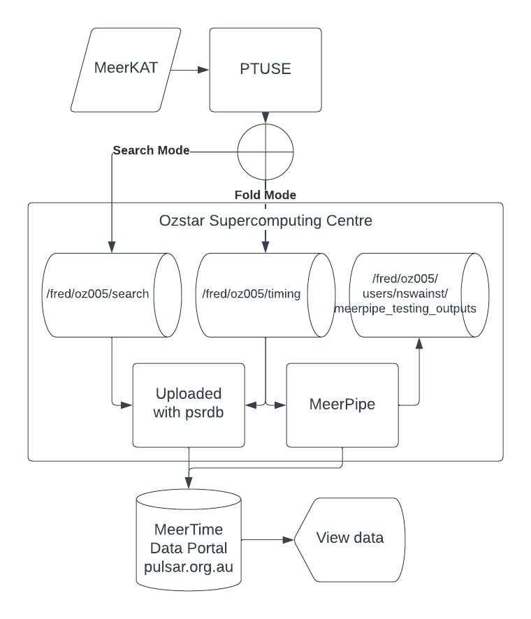

# MeerKAT Pulsar Processing Summary

The following is a high level summary of how we turn radio waves into processed pulsar data displayed on the [MeerTime Data Portal](https://pulsars.org.au).
This summary will include links to the other parts of this documentation and other resources that go into more detail of each aspect of the process.
Many of these subsections will have one of the following labels to help you find the information you desire quicker:

 - **user**: User documentation is for someone who wants to use the pipeline or webpages so needs to know how to load software, what options are available and where to find data.
 - **science**: Scientist documentation is for someone who wants to understands the methods and math used in the process to increase their understanding or find potential issues
 - **dev**: Developer documentation is for someone who wants to understand how the software works so they can add new features.

The high level steps are the following:

- Observed with MeerKAT
- Preprocessed with the PTUSE
- Transferred to OzSTAR
- Observation metadata uploaded to [MeerTime Data Portal](https://pulsars.org.au)
- Data processed using MeerPipe
- Observation results uploaded to [MeerTime Data Portal](https://pulsars.org.au)



The following documentation will go into more detail of each of these steps.


## Observed with MeerKAT

The MeerKAT telescope is described in detail in the [MeerKAT User Guide (user, science)](https://public.ska.ac.za/meerkat/meerkat-user-guide/) and the the following papers (science):

 - [MeerKAT - The South African Array With Composite Dishes and Wide-Band Single Pixel Feeds](https://ui.adsabs.harvard.edu/abs/2009IEEEP..97.1522J/abstract)
 - [The MeerKAT Radio Telescope](https://ui.adsabs.harvard.edu/abs/2016mks..confE...1J/abstract)
 - [The MeerKAT telescope as a pulsar facility: System verification and early science results from MeerTime](https://ui.adsabs.harvard.edu/abs/2020PASA...37...28B/abstract)

Some of the methods and software used with MeerKAT are described in the [engineering documentation (science, dev)](https://katgpucbf.readthedocs.io/en/latest/index.html).

The MeerKat archive and other observing tools can be found in the [SARAO apps web page (user)](https://apps.sarao.ac.za/)

## Preprocessed with the PTUSE

The PTUSE is described in detail in [The MeerKAT telescope as a pulsar facility: System verification and early science results from MeerTime](https://ui.adsabs.harvard.edu/abs/2020PASA...37...28B/abstract).
The PTUSE comprises of four servers (each server represents the beam ID in the observation metadata) which can be used to dedisperse and fold the data in real time.
The PTUSE outputs archives in eight second sub-integrations which may have some timing smear in them due to the initial inaccurate ephemeris used during the observation.
If you ever want to inspect the ephemeris used to create an archive file you can use the following command:

```
vap -E <archive_file>
```

## MeerPipe

MeerPipe is the Nextflow pipeline used to process MeerKAT pulsar data. It is described in detail in the [MeerPipe documentation (user, science, dev)]()

## Transferred to OzSTAR

The description of where the data is stored on OzSTAR can be found in the [OzSTAR Storage (user)](/meerkat_pulsar_docs/ozstar_storage/).